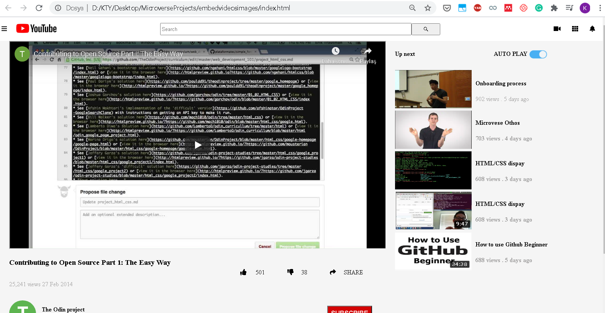
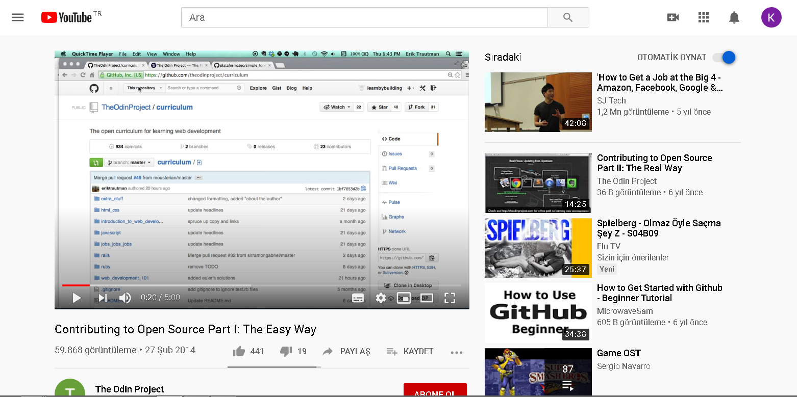

# Project Name

**Embedded videos and images on webpage**

-This project is about embedding a video in web page which start playing by clicking on the play button. It also shows the    recommended video's thumbnail preview(as images and not as actual videos) and their title and numbers of views.

Reference page link may be found below

Additional description about the project and its features.

## Built With

- HTML5,
- CSS3

## Live Demo

https://rawcdn.githack.com/enaburekhan/embedvideosimages/d438a8db1a4fa7294cf8188a5113dfd2fe44f3df/index.html 

## Getting Started

To get a local copy up and running follow these simple example steps.

### Prerequisites
- There is no special prerequisites to run this project locally
- navigate inside by typing cd embedvideosimages

### Setup
- Clone this repository using git clone git@github.com:enaburekhan/embedvideosimages.git
- navigate inside by typing cd embedvideosimages

### Install
No installation was required

### Usage
open index.html file within your browser

### Run tests
Running a test is not required.

### Deployment

## Authors

👤 **Author1**

- Github: https://github.com/enaburekhan
- Twitter: https://twitter.com/enaburekhaneric
- Linkedin: https://www.linkedin.com/in/eric-enaburekhan-801a28100/

👤 **Author2**

- Github: https://github.com/ktyyctrk
- Twitter: https://twitter.com/ktyyctrk
- Linkedin: https://www.linkedin.com/in/kyuceturk/

## 🤝 Contributing

Contributions, issues and feature requests are welcome!

Feel free to check the [issues page](issues/).

## Show your support

Give a ⭐️ if you like this project!

## Acknowledgments

- Many thanks to Microverse for given my partner and I, the opportunity learn and grow.

## 📝 License

This project is [MIT](lic.url) licensed.
